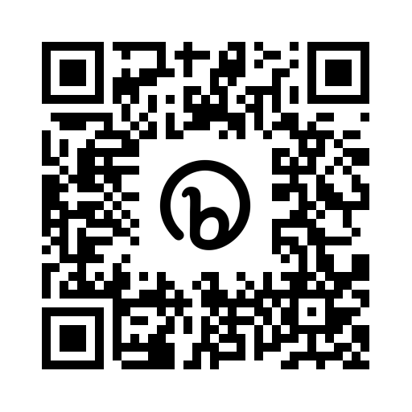

# Cooking Up AI: Generative Techniques for Crafting a Delectable Digital Experience

## Load This Github Repo: bit.ly/cooking-up-generative-ai-workshop

## Workshop Summary/Description:

In this interactive workshop, participants will explore the practical applications of generative AI by creating a dynamic micro-service for a fictional restaurant website, complete with a tantalizing menu. Through hands-on demonstrations, attendees will learn to harness the power of AI to generate visually stunning and lifelike food images, which will not only enhance the digital menu but also serve as a valuable resource for chefs in crafting their culinary presentations. By the end of the session, participants will have gained valuable insights into leveraging AI for creative problem-solving and delivering captivating digital experiences.

## What tools can we use?

- **Tools to Download / Use**:
  - JSFiddle (Online JavaScript, HTML, CSS editor/preview): https://jsfiddle.net/
  - VS Code (Code IDE Editor): https://code.visualstudio.com/
  - Docker for Desktop: https://www.docker.com/products/docker-desktop/
- **Language**:
  - Bard: https://bard.google.com/
  - Bing Chat: https://www.bing.com/chat (Requires the Edge Browser)
  - ChatGPT: https://chat.openai.com/
  - GPT API:
    - Playground: https://platform.openai.com/playground (Requires an OpenAI API Account)
- **Images**:
  - Bing Chat: https://www.bing.com/chat (Requires the Edge Browser)
  - Dall-E: https://labs.openai.com/
  - Blue Willow: https://discord.gg/AnAeVzqQ
  - MidJourney (paid): https://discord.gg/AnAeVzqQ (Same server)

## Team Experience

- Form teams of people at each table, 4-5 people to a team
- Each Team will come up with their own restaurant and theme
- At least one member of a team should have access to a generative AI service (images and language)
- At least one member of the team should be willing to write some code
- Team roles:
  - Someone who can write code
  - Someone to interact with Language AI
  - Someone to interact with Image AI
  - Others who are idea / creative directors

## Learning Objectives

- Highlight how human creativity drives AI innovation
  - This is one of the reasons we're going to be working in teams
  - Also working in teams utilizes talents, such as technical and creative.
- Understand the practical applications of generative AI in digital experiences
- You are the explorer of your imagination, and your task is to define the creative idea, and have a picture in your mind of what your intended outcome will be. The purpose of the AI is to help you realize your vision by filling in the blanks and performing the "gruntwork".
- When you get stuck, consider ways to ask the generative language model AI the questions that will help get you un-stuck. It is the ultimate tutor!

### Task:

- Use Generative AI to formulate a restaurant experience:

  - What is the theme of the restaurant?
  - What is the name of the restaurant?
    - Use AI to come up with the images for the restaurant:
      - Environment / Dining room / Kitchen / Staff, etc.
  - What is the menu?
    - Establish limits (e.g. 5 appetizers, 5 entrees, 5 desserts)
  - What is a detailed description for each menu item?
    - Create images for a selection of menu items.
  - What other unique ideas can you come up with and generate?

- Create a dynamic micro-service for a fictional restaurant website
- Generate lifelike food images using AI techniques
- Enhance digital menus with visually captivating AI-generated content
- Apply AI-driven solutions for creative problem-solving in various contexts
- Explore the potential of AI to improve user engagement and experiences

## Restaurant Website

- Website should have at least one page:
  - Should contain an image of the restaurant, and the menu
  - Can have multiple pages if the team desires
- The Docker image should contain the website code
- Local browser should be able to interact with the Docker image (site)

## Docker

- Install Docker Desktop
- Create a Dockerfile
- Build the Docker image
- Run the Docker image

## Expectations

The time it would take a small team to accomplish these goals without the use of AI would depend on a number of factors such as the team's skill level, the complexity of the website, and the amount of content to be created.

Website Development (HTML, CSS, JavaScript): For a basic website with 1-2 pages, a skilled developer could create this in about 2 weeks. However, if the website is more complex or requires custom functionality, it could take several weeks to a couple of months.

Content Creation (Restaurant Theme, Menu, Descriptions): This would depend on the creativity and writing skills of the team. If the team already has a clear idea of the restaurant theme and menu, this could be done in about a week. However, to brainstorm and create this from scratch, it typically takes several weeks.

Image Creation: Creating custom images for the restaurant and menu items could be time-consuming, especially if the team doesn't have a skilled graphic designer. This could take a few weeks.

So, in total, for a small team of 4-5 people with a mix of skills (web development, content creation, graphic design), it could take anywhere from a few weeks to a few months to accomplish these goals without the use of AI. However, with the use of AI, these tasks could be completed much faster, especially the content and image creation tasks.

## Prompt examples

### Text Generation

- "Generate a unique name for a restaurant that serves fusion cuisine."
- "Create a menu for a vegan restaurant."
- "Describe the ambiance and decor of a seaside seafood restaurant."
- "Write a backstory for a restaurant located in a historic building."

### Image Generation

- "Generate an image of a cozy, rustic Italian restaurant."
- "Create an image of a modern, minimalist sushi bar."
- "Generate an image of a vibrant, colorful Mexican restaurant."
- "Create an image of a chic, upscale French restaurant."

### Other misc AI prompt examples

Here are some additional ways ChatGPT can be utilized, along with example prompts:

**1. Generating Restaurant Concepts:**
ChatGPT can be used to generate unique and creative concepts for restaurants. This could include the restaurant's theme, backstory, or unique selling points.

- "Generate a unique concept for a restaurant that combines Italian and Japanese cuisines."
- "Create a backstory for a restaurant located in a repurposed lighthouse."
- "What would be a unique selling point for a restaurant that only serves breakfast foods?"

**2. Creating Menu Descriptions:**
ChatGPT can be used to write detailed and enticing descriptions of menu items.

- "Write a description for a gourmet burger with truffle fries."
- "Describe a decadent chocolate dessert suitable for a high-end restaurant."
- "Create a description for a refreshing summer cocktail."

**3. Crafting Marketing Materials:**
ChatGPT can be used to write marketing materials for the restaurant, such as ad copy, social media posts, or press releases.

- "Write a social media post announcing the grand opening of a new seafood restaurant."
- "Create a press release for a restaurant that has just been awarded a Michelin star."
- "Generate a catchy slogan for a family-friendly pizza restaurant."

**4. Answering Customer Queries:**
ChatGPT can be used to simulate answering customer queries, which could be useful for training staff or for creating a FAQ section on a website.

- "How would you respond to a customer who wants to know if you have gluten-free options?"
- "What would you say to a customer who is unhappy with their meal?"
- "How would you answer a query about the restaurant's opening hours?"

**5. Developing Restaurant Policies:**
ChatGPT can be used to help develop policies for the restaurant, such as booking policies, dress codes, or rules for large groups.

- "Write a policy for booking large groups at a small restaurant."
- "Create a dress code policy for an upscale restaurant."
- "Generate a policy for handling customer complaints."

These are just a few examples of how ChatGPT can be used in the context of this workshop. The possibilities are vast and can be tailored to the specific needs and goals of the participants.
